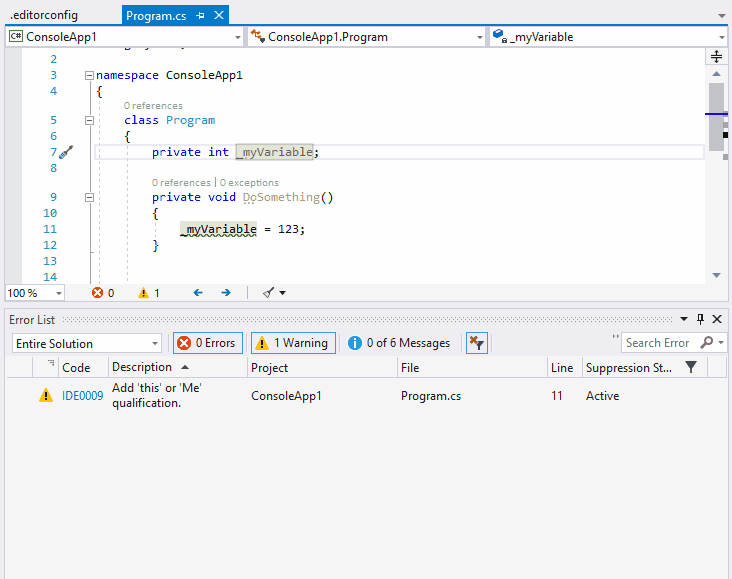

# Set up coding conventions with .editorconfig

Microsoft recommend to use an .editorconfig file to define and share coding convention rules between a team.
Editorconfigs is a standardized way to define coding styling conventions. It can be used for different programming languages and is supported by all popular IDEs like Visual Studio, Eclipse and much more.

## Installation

1. Add a .editorconfig file to the solution folder
2. Copy the recommened default options from [.editorconfig example](hhttps://github.com/editorconfig/editorconfig-core-net/blob/master/.editorconfig) and insert it into the .editorconfig file
3. Rebuild solution

That's it! Compiler Roslyn and Intellisense supports .editorconfig natively.

## Customize rules

Styling rules are defined in the .editorconfig file. 
A rule consists of a rule name (e.g. dotnet_style_qualification_for_field), a rule value (e.g. true) and a severity level (e.g. warning).
The rule value should always be set to true.

1. Change the rules of the section "this. preferences" as follows:

```csharp
# this. preferences
dotnet_style_qualification_for_field = true:warning
dotnet_style_qualification_for_property = true:warning
dotnet_style_qualification_for_method = true:warning
dotnet_style_qualification_for_event = true:warning
```

2. Rebuild the solution
3. Fix the warning with quick actions




## See also

* [Website of the EditorConfig project](https://editorconfig.org/)
* [GitHub Wiki of EditorConfig](https://github.com/editorconfig/editorconfig/wiki/EditorConfig-Properties)
* [Microsoft documentation about it's editor config settings](https://github.com/MicrosoftDocs/visualstudio-docs/blob/master/docs/ide/editorconfig-code-style-settings-reference.md)
* [Microsoft GitHub documentation about it's editor config settings](https://docs.microsoft.com/en-us/visualstudio/ide/editorconfig-code-style-settings-reference)
