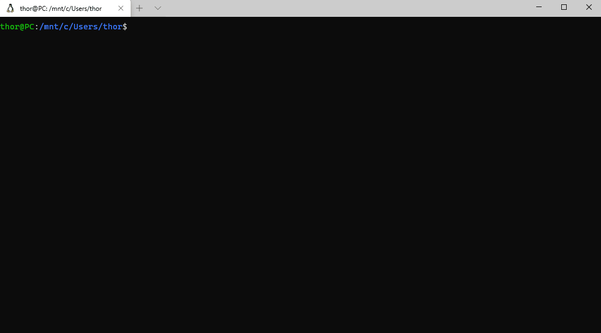

# Set up kubectl and helm with auto-completion in Windows Terminal

Cmd.exe does not offer auto-completion while typing. 
So Windows Subsystem for Linux provides a complete Linux subsystem within Windows.
There we can use a common Linux terminal called bash which can be used as an replacement for cmd.exe and powershell with access to windows folders and so on.

Bash completion is a nice feature of the Linux bash which completes scripts while typing and enter tab.

## Perquisitions

1. [Docker for Windows](https://hub.docker.com/editions/community/docker-ce-desktop-windows )
2. [Windows Terminal](https://github.com/microsoft/terminal/releases )
3. [Windows-Subsystem für Linux](https://docs.microsoft.com/de-de/windows/wsl/install-win10 )

## Installation

Follow the installation instructions of the listed packages above. Enable kubernetes for windows and get familar with the Windows Terminal.

1. Also install [helm for windows](https://helm.sh/docs/intro/install/) and make sure helm is working on Windows.
2. Open Windows Terminal: "wt.exe"
3. Open a wsl session
4. [Optional] Change the user settings so that an admin doesn't enter a password.

```bash
# Edit the sudoers with the visudo command
sudo visudo

# Change the %sudo group to be password-less
%sudo   ALL=(ALL:ALL) NOPASSWD: ALL
```

5. Install bash-completion
```bash
apt-get install bash-completion
```

6. Install kubernetes on wsl
```bash
sudo apt-get update && sudo apt-get install -y apt-transport-https gnupg2
curl -s https://packages.cloud.google.com/apt/doc/apt-key.gpg | sudo apt-key add -
echo "deb https://apt.kubernetes.io/ kubernetes-xenial main" | sudo tee -a /etc/apt/sources.list.d/kubernetes.list
sudo apt-get update
sudo apt-get install -y kubectl
```

7. Add kubernetes completion to bashrc
```bash
echo 'source <(kubectl completion bash)' >>~/.bashrc
kubectl completion bash >/etc/bash_completion.d/kubectl
```

8. Install helm on wsl
```bash
curl https://baltocdn.com/helm/signing.asc | sudo apt-key add -
sudo apt-get install apt-transport-https --yes
echo "deb https://baltocdn.com/helm/stable/debian/ all main" | sudo tee /etc/apt/sources.list.d/helm-stable-debian.list
sudo apt-get update
sudo apt-get install helm
```

9. Add helm completion to bashrc

```bash
helm completion bash > /etc/bash_completion.d/helm
```

The Ubuntu folder can be accessed by Windows Explorer by enter the path "\\wsl$\Ubuntu-20.04" into path filed of windows explorer. 


## Live Demo



## See also

* [Kubernetes Installation Instructions for Windows](https://kubernetes.io/blog/2020/05/21/wsl-docker-kubernetes-on-the-windows-desktop/ )
 