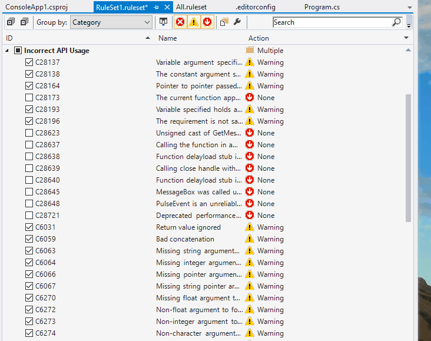

# Set up static code analysis with FxCop

Microsoft offers a great way to add static code analysis to .net projects.

## Installation

1. Add a new item "Code Analysis Rule Set" to the solution folder
2. Open the file from within Visual Studio
3. Group the rules by category
4. Either set severity level of each rule or use severity levels from an existing ruleset
5. Add nuget package FxCop as reference to each project
6. Reference the new ruleset file for each project 

```xml
<PropertyGroup>
  <CodeAnalysisRuleSet>..\custom.ruleset</CodeAnalysisRuleSet>
</PropertyGroup>
```
7. Rebuild solution


That's it! Now compiler Roslyn shows the issues and Intellisense gives hints how to fix them.

## Customize rules

Styling rules are defined in the .editorconfig file. 
A rule consists of a rule name (e.g. dotnet_style_qualification_for_field), a rule value (e.g. true) and a severity level (e.g. warning).
The rule value should always be set to true.

1. Open "Code Analysis Rule Set"
2. Group them by name or category
3. Check the rule and set severity level
4. Rebuild the solution
5. Fix the warning with quick actions




## Supress Warnings of a specific rule

There are several ways to supress warnings.


|          |   Where   |                           How                                                          |      
| -------- | --------- | -------------------------------------------------------------------------------------- | 
|  1.      | Solution  | Disable rule or change severity level to information or suggestion in the ruleset file |
|  2.      | Project   | Edit csproj file in notepad++ and add a `<NoWarn>` element containing the rule id      |
|  3.      | File      | Add a compiler directive into the sources |                   


### Disable a rule solution wide

1. Open the ruleset file in VisualStudio 
2. Search for the Rule ID which causes an error, e.g. CS0169
3. Uncheck that rule or change the severity level to information or suggestion

### Disable a rule project wide

Edit .csproj file in a Texteditor and add a NoWarn element with the ruleID to the property group. Multiple ruleIDs has to be separated with semicolons.

```xml
<PropertyGroup>
  <NoWarn>CS0169;CA1234</NoWarn>
</PropertyGroup>
```

### Disable a rule in a single line of code

With that directive we tell the compiler to skip that specific warning.

```csharp
#pragma warning disable CS0169  
      private int _unusedVariable;
#pragma warning restore CS0169  
```

## See also

* [Microsoft documentation about FxCop](https://docs.microsoft.com/en-us/visualstudio/code-quality/install-fxcop-analyzers)
* [Microsoft documentation about suppressing rule violations](https://docs.microsoft.com/en-us/visualstudio/ide/how-to-suppress-compiler-warnings)
 