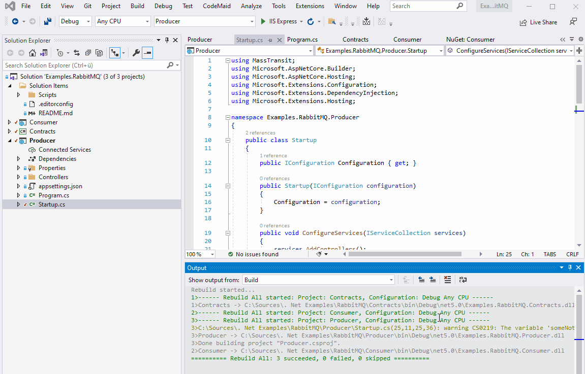

# Set up static code analysis with FxCop

Microsoft offers a great way to add static code analysis to .net projects.


## Installation

Add Nuget to all the projects.

```powershell
Install-Package Microsoft.CodeAnalysis.CSharp
```

To enable analysis just go to the project properties in Visual Studio and go to the tab CodeAnalysis and enable features you want to have.

An other way is to add the entries manually in the csproj files:

```xml
<PropertyGroup>
  <!-- Enable Code Analysis -->
  <EnableNETAnalyzers>true</EnableNETAnalyzers>

  <!-- Enable editorconfig -->
  <EnforceCodeStyleInBuild>true</EnforceCodeStyleInBuild>
</PropertyGroup>
```


That's it! Now compiler Roslyn shows the issues and Intellisense gives hints how to fix them.

## Customize rules

The easiest way to customize the severity level of issues is to use the editorconfig file.

## Supress Warnings of a specific rule

There are several ways to supress warnings.


|          |   Where   |                           How                                                          |      
| -------- | --------- | -------------------------------------------------------------------------------------- | 
|  1.      | Solution  | Disable rule or change severity level to information or suggestion in the ruleset file |
|  2.      | Project   | Edit csproj file in notepad++ and add a `<NoWarn>` element containing the rule id      |
|  3.      | File      | Add a compiler directive into the sources |                   


### Disable a rule solution wide

1. Open the ruleset file in VisualStudio 
2. Search for the Rule ID which causes an error, e.g. CS0169
3. Uncheck that rule or change the severity level to information or suggestion

### Disable a rule project wide

Edit .csproj file in a Texteditor and add a NoWarn element with the ruleID to the property group. Multiple ruleIDs has to be separated with semicolons.

```xml
<PropertyGroup>
  <NoWarn>CS0169;CA1234</NoWarn>
</PropertyGroup>
```

### Disable a rule in a single line of code

With that directive we tell the compiler to skip that specific warning.

```csharp
#pragma warning disable CS0169  
      private int _unusedVariable;
#pragma warning restore CS0169  
```

## Run Code Anaylysis in Build Pipelines


```bash
dotnet msbuild -t:rebuild  -warnaserror
```

## Demo




## See also

* [Microsoft documentation about Code Quality](https://docs.microsoft.com/de-de/dotnet/fundamentals/code-analysis/overview)
 